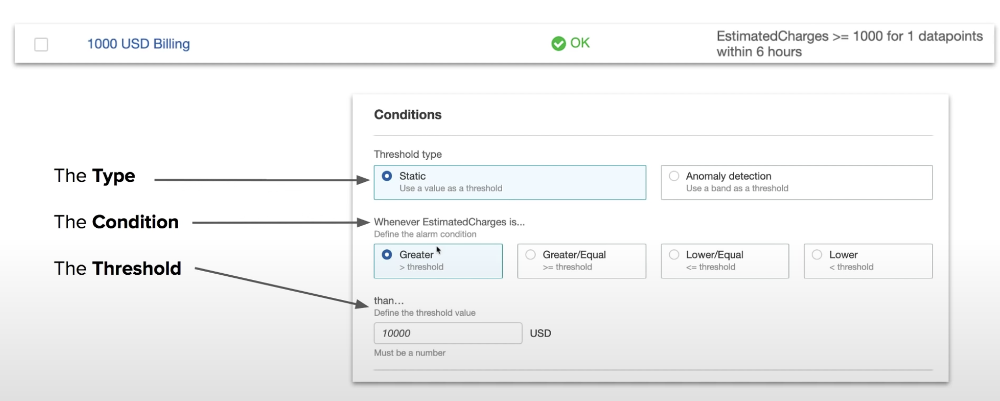
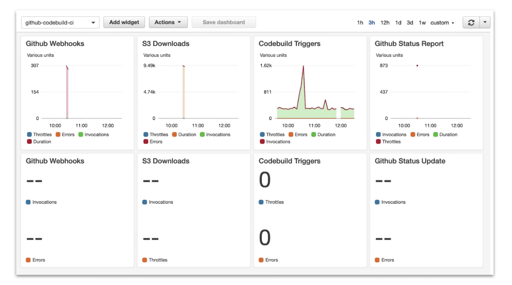

## Introduction

AWS CloudWatch is a **monitoring solution** for your AWS resrouces.

CloudWatch is a **collection of monitoring tools** as follows
* CloudWatch **Logs**
  * Any custom log data, Memory Usage, Rails Logs, Nginx Logs
* CloudWatch **Metrics**
  * Metrics that are based off of logs. eg. Memory Usage.
* CloudWatch **Events**
  * Trigger an event based on a condition. eg. ever hour take snapshot of server.
* CloudWatch **Alarms**
  * Triggers notifications based on metrics which breach a defined threshold.
* CloudWatch **Dashboards**   
  * Creat visualizations based on metrics.

## CloudWatch Logs

CloudWatch Logs is used to monitor, store, and access your log files.

A **Log Group** is a collection of logs. Log files must belong to a log group.

A Log in a Log Group is called a **Log Stream**

By default, **logs are kept indefinitely and never expire**

Most AWS Services are integrated with CloudWatch Logs. Logging of services sometimes needs to be turned on requires the IAM Permission to write to CloudWatch Logs.

## CloudWatch Metrics

CloudWatch comes with many **perdefined** metrics.

**EC2 Per-Instance Metrics**
* CPUUtilization
* DiskReadOps
* DiskWriteOps
* DiskReadBytes
* DiskWriteByres
* NetworkIn
* NetworkOut
* NetworkPacketsIn
* NetworkPacketsOut

## CloudWatch Events

Trigger an event based on a condition or on schedule.

**Event Source** $\longrightarrow$ **Targets**

Schedule is like a serverless **Cron tab**

## CloudWatch Custom Metrics

Using the **AWS CLI or SDK** you can create and publish your own **custom metrics**

### High Resolution Metrics

When you publish a custom metric, you can define it as either standard resolution or **high resolution**

High resolution lets you track **under 1 minute down** to **1 second**

With High Resolution you can track at
* **1 second**
* 5 seconds
* 10 seconds
* 30 seconds
* multiple of 60 seconds.

## CloudWatch Alarms

Triggers a notifications based on **metrics** which **breach** a defined threshold.

## CloudWatch Dashboard

Create **custom dashboards** from CloudWatch Metrics.

## CloudWatch Availability

How often CloudWatch will collect and make available data.

||EC2|Other services|
|---|---|---|
|Basic Monitoring|5 minutes interval|**1 minute(default)**/3 minutes/5 minutes|
|Details Monitoring|1 minute interval||

## Agent & Host Level Metrics

Some metrics you might think we tracked by default for EC2 instances are not, and require install the **CloudWatch Agent**

The CloudWatch Agent is a script which can be instanlled via **System Manager** Run Command onto the target EC2 instance.

CouldWatch will track at the Host Level by default
* CPU Usage
* Network Usage
* Disk Usage
* Status Checks
  * Underlying Hypervisor status.
  * Underlying EC2 instance status.

The folloing require the Agent to get detailed metrics for
* **Memory** utilization
* Disk swap utilization
* **Disk space** utilization
* Page file utilization
* Log collection

## Cheat Sheet
* CloudWatch is a collection of monitoring service: **Dashboards**, **Events**, **Alarms**, **Logs** and **Metrics**.
* CloudWatch **Logs**
  * Log data from AWS services. eg. CPU Utiliaztion.
* CloudWatch **Metrics**
  * Respresents a time-ordered set of data points, A variable to monitor. eg. CPU Utilization over time.
* CloudWatch **Events**
  * Trigger an event based on a condition. eg. ever hour take snapshot of server
* CloudWatch **Alarm**
  * Triggers notifications based on metrics when a defined threshold is breached.
* CloudWatch **Dashboard**
  * Create visualizations based on metrics
* EC2 monitors at 5 mins intervals and at Detailed Monitoring 1 minute intervals
* Most other service monitor at 1 minute intervals, with intervals of 1, 3, 5 minutes.
* Logs must belong to a **Log Group**
* CloudWatch Agent needs to be installed on EC2 host to track **Memory Usage** and **Disk Size**
* You can create stream custom log files. eg. production.log
* Custom Metrics allow you to track High Resolution Metrics a sub minute intervals all the way down to 1 second.
