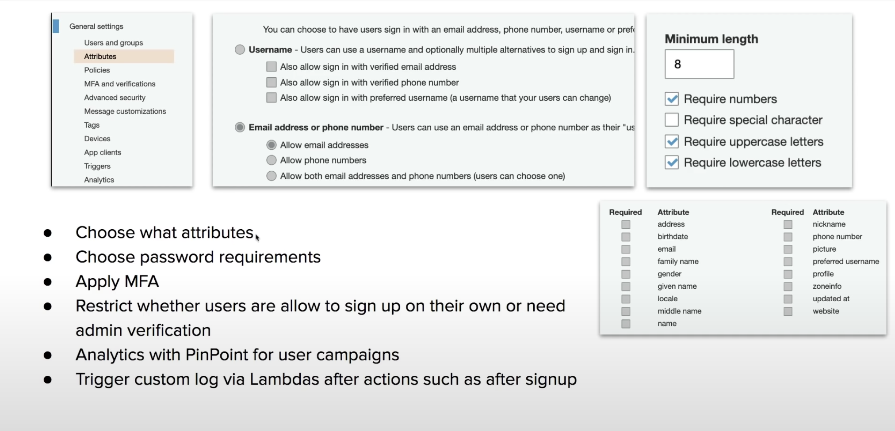

## Introduction

Cognito is a decentralized managed Authentication. Sign-up, sing-in intergration for your apps. Social identity provider. eg. Facebook, Google.

* Cognito User Pools
    * User directory with authentication to IpD(Identity Providers) to grant access to your app.
* Cognito Identity Pools
    * Provide temporary credentials for users to access AWS Services
* Cognito Sync
    * Syncs user data and preferences across all devices.

## Web Identity Federation
* Web Identity Federation
    * To exchange identity and security information between an identiiy provider(IdP) and an application
* Identity Provider(IdP)
    * A trusted provider of your user identity that lets you use authenticate to access other services.
    * Identity Providers could be: Facebook, Amazon, Google, Twitter, Github, LinkedIn
* Types of Identity Providers
    * The technology that behind the Identity Providers

## User Pools

**User Pools** are users directories userd to manage the actions for web and mobile apps such as
* Sign-up
* Sign-in
* Account recovery
* Account confirmation
---

* Allows users to sign-in directly to the User Pool, or using Web Identity Federation.
* Uses AWS Cognito as the identity broker between AWS and the identity provider.
* Successful user authentication generates a JSON Web Token(JWT)
* User Pools can be thought of as the account used to acces the system(ie email address and password)

## Identity Pools

Identity Pools provide temporary AWS credentials to access services. eg. S3, DynamoDB.

Identity Pools can be thought of as the actual mechanism authorizing access to the AWS resrouces.

## Cognito Sync

Sync user data and prefrences across devices with one line of code.

Cognito uses **push synchronization** to push updates and synchronize data.

Use Simple Notification Service(SNS) to send notifications to all user devices when data in the clode changes.

## CheatSheet
* Cognito is decentralized managed authentication system. When you need to easily add authentication to your mobile and desktop app, think Cognito.
* **User Pools**
    * User dircetory, allows users to authenticate using Oauth to LpD such as Facebook, Google, Amazon to connect to web-applications.
    * Cognito User Pool is in itself a LpD.
* User Pools user **JWTs** for to persist authentication.
* **Identity Pools** provide **temporary AWS creadentials** to access services eg. S3, DynamoDB.
* **Cognito Sync** can sync **user data** and **preference** across devices with one line of code(powered by SNS)
* **Web Identity Federation** exchange identity and security information between an identity provider(LdP) and an application
* **Identity Provider(ldP)**
    * A trusted provider of your user identity that lets you use authenticate to access other services. eg. Facebook, Twitter, Google, Amazon.
* **OIDC** is a type of Identity Provider which uses Oauth.
* **SAML** is a type of Identity Provider which is userd for Single Sign-on
