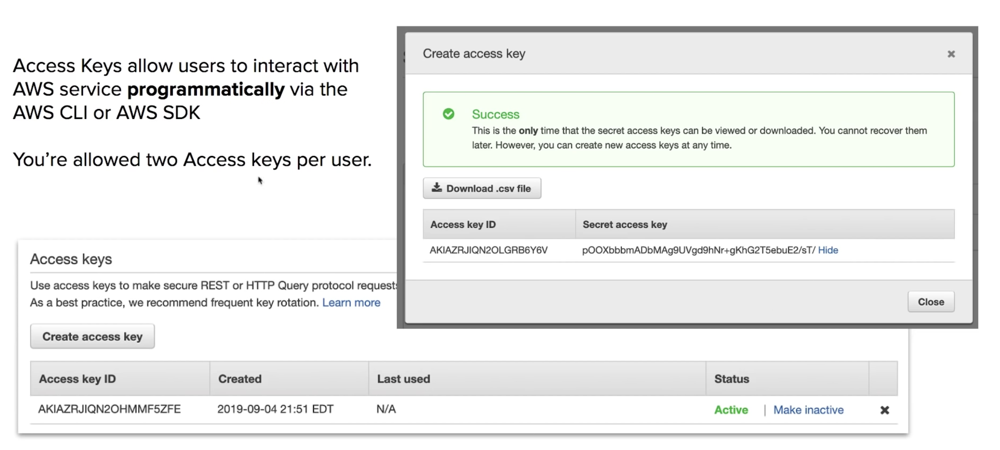
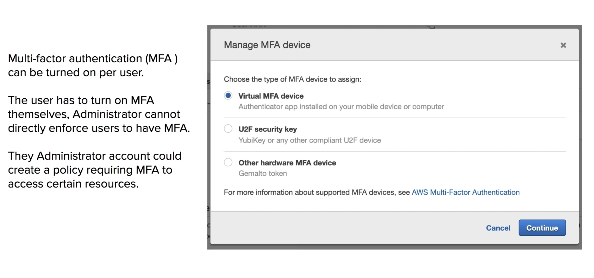

## IAM Core Compenents

IAM allows **management** of access of **users** and **resources**

* IAM Users
  * End users who log into the console or interact with AWS resource programmatically.
* IAM Groups
  * Group up your Users so they all share permission levels of the group.
  * eg. Administrators, Developers, Auditors
* IAM Roles
  * Associate permissions to a Role and then assign this to an Users or Groups
* IAM Policies
  * JSON documents which grant permissions for a specific user, group, or role to access services.
  * Policies are attached to **IAM Identities**


## Types of Policies
* Managed Policies
  * A policy which is managed by AWS, which you cannot edit. Managed policies are labeled with an **orange box**
* Customer Managed Policies
  * A policy created by the customer which is editable. Customer policies have no symbol beside them.
* Inline policy
  * A policy which is directly attached to the user.

## [Policy Structure](https://docs.aws.amazon.com/IAM/latest/UserGuide/reference_policies_elements.html)

```json
{
  "Version": "2012-10-17",
  "Statement": [
    {
      "Sid": "FirstStatement",
      "Effect": "Allow",
      "Action": ["iam:ChangePassword"],
      "Resource": "*"
    },
    {
      "Sid": "SecondStatement",
      "Effect": "Allow",
      "Action": "s3:ListAllMyBuckets",
      "Resource": "*"
    },
    {
      "Sid": "ThirdStatement",
      "Effect": "Allow",
      "Action": [
        "s3:List*",
        "s3:Get*"
      ],
      "Resource": [
        "arn:aws:s3:::confidential-data",
        "arn:aws:s3:::confidential-data/*"
      ],
      "Condition": {"Bool": {"aws:MultiFactorAuthPresent": "true"}}
    }
  ]
}
```

* Version – Specify the version of the policy language that you want to use. We recommend that you use the latest 2012-10-17 version. For more information, see IAM JSON policy elements: Version
* Statement – Use this main policy element as a container for the following elements. You can include more than one statement in a policy.
* Sid (Optional) – Include an optional statement ID to differentiate between your statements.
* Effect – Use Allow or Deny to indicate whether the policy allows or denies access.
* Principal (Required in only some circumstances) – If you create a resource-based policy, you must indicate the account, user, role, or federated user to which you would like to allow or deny access. If you are creating an IAM permissions policy to attach to a user or role, you cannot include this element. The principal is implied as that user or role.
* Action – Include a list of actions that the policy allows or denies.
* Resource (Required in only some circumstances) – If you create an IAM permissions policy, you must specify a list of resources to which the actions apply. If you create a resource-based policy, this element is optional. If you do not include this element, then the resource to which the action applies is the resource to which the policy is attached.
* Condition (Optional) – Specify the circumstances under which the policy grants permission.

## Password Policy

In IAM you can set **Password Policy** 

To set the minimum requirements of a password and **rotate** passwords so user have to update their passwords after **X** days.

## Programmatic Access Keys


## Multiple-Factor Authentication


## CheatSheet

* **Identity Access Management** is used to manage access to users and resources.
* IAM is an universal system.(applied to all regions at the same time). 
  * IAM is a free service.
* A root account is the account initially created when AWS is set up(full administrator)
* New IAM accounts have no permission by default until granted.
* New users get assigned an **Access Key Id** and **Secret** when first created when you give them programmatic access.
* Access Keys are only used for CLI and SDK(cannot access console)
* Access Keys are only shown once when created. If lost they must be deleted/recreated again.
* Always setup MFA for Root Accounts.
* Users must enable MFA on their own, Administrator cannot turn it on for each user.
* IAM allows you set password policies to set minimum password requriements or rotate passwords.
* **IAM Identities** are Users, Groups and Roles.
* **IAM Users**
  * End users who log into the console or interact with AWS resrouces programmatically.
* **IAM Groups**
  * Group up your Users so they all share permission levels of the group
  * eg. Administrators, Developers, Auditors
* **IAM Roles**
  * Associate permissions to a Role and then assign this to a User or Groups.
* **IAM Policies** 
  * JSON documents which grant permissions for a specific user, group, or role to access services.
  * Policies are atttached to an IAM Identities.
* **Managed Policies** are policies provided by AWS and cannot be edited
* **Customer Managed Policies** are policies created by use the customer, which you can edit.
* **Inline Policies** are policies which are directly attached to a user.
