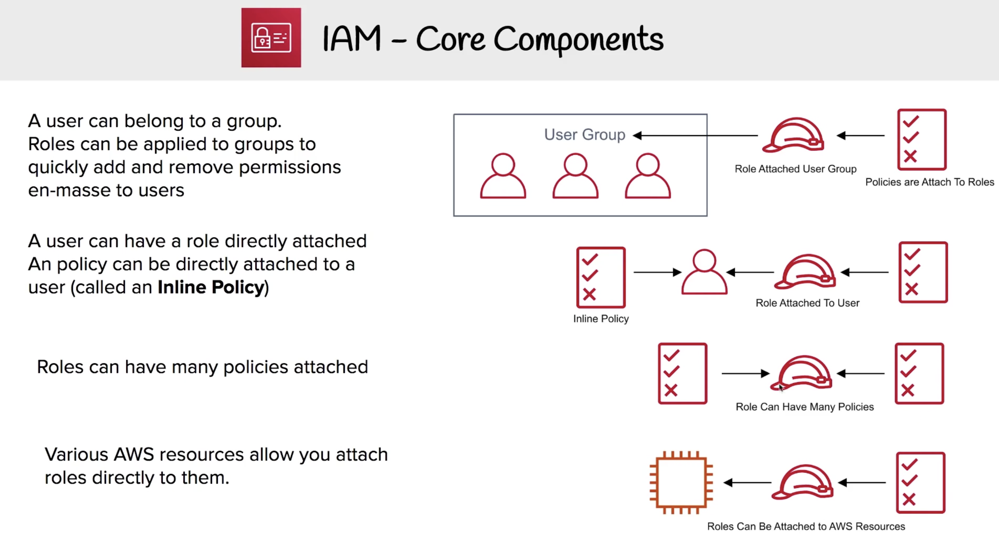

## IAM Core Compenents

IAM allows **management** of access of **users** and **resources**

* IAM Users
  * End users who log into the console or interact with AWS resource programmatically.
* IAM Groups
  * Group up your Users so they all share permission levels of the group.
  * eg. Administrators, Developers, Auditors
* IAM Roles
  * Associate permissions to a Role and then assign this to an Users or Groups
* IAM Policies
  * JSON documents which grant permissions for a specific user, group, or role to access services.
  * Policies are attached to **IAM Identities**

## Types of Policies
* Managed Policies
  * A policy which is managed by AWS, which you cannot edit. Managed policies are labeled with an **orange box**
* Customer Managed Policies
