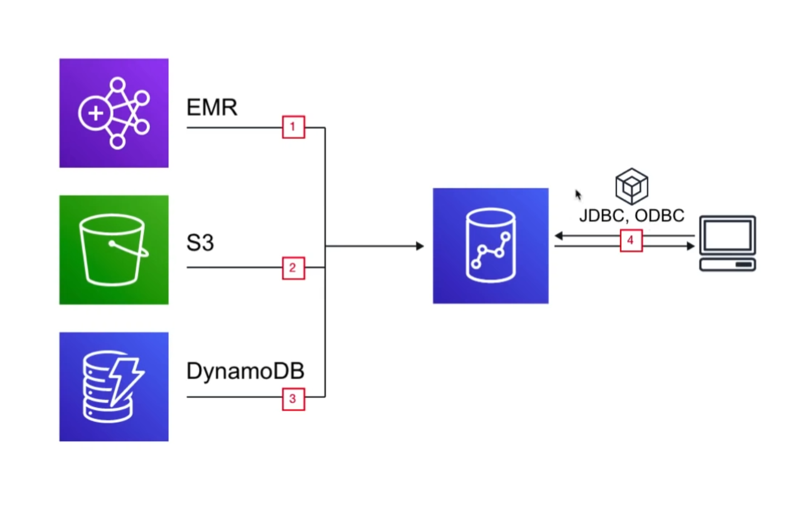

## What is a Database Transaction

A transaction symbolizes a unit of work performed within a database management system.

eg. reads and writes.

|Database|Data Warehouse|
|---|---|
|Online **Transaction** Processing(OLTP)|Online **Analytical** Processing(OLAP)|
|A database was built to store current transactions and enable **fast access to specific transactions** for ongoing business processes|A data warehouse is built to store large quantites of historcal data and **enable fast, complex queries across all the data**|
|**Adding Items To Your Shoping List**|**Generating Reports**|
|Single Source|Multiple Sources|
|Short transactions(small and simple queries) with an emphasis on writes|Long transactions(long and complex queries) with an emphasis on reads.|

## Introduction

AWS Redshift is the AWS managed, petabyte-scale solution for **Data Warehousing**.

Pricing starts at just $0.25 per hour with no upfront costs or commitments.

Scale up to petabytes for $1000 per terbyte, per year.

Redshift is price is less than 1/10 cost of most similar services.

* Redshift is used for Business Intelligence.
* Redshift uses OLAP(Online Analytics Processing System)
* Redshift is **Columnar Storage** Database.

**Columnar Storage** for database tables is an important factor in optimizing analytic query performance, because it drasticall reduces the overall disk I/O requirements and reduces the amount of data you need to load from disk.

## Use Case

We want to continuously COPY data from
1. EMR.
2. S3
3. DynamoDB
to power a custom Business Intelligence tool.

Using a third-party library we can connect and query Redshift for data.

## Columnar Storage

**Columnar Storage** stores data together as columns instead of rows.

**OLAP** applications look at multiple records at the same time. You save memory because you fetch just the columns of data you need instead of whole rows.

Since data is stored via column, that means all data is of the same data-type allowing for easy compression.

## Configurations

### Single Node
Nodes come in sizes of **160GB**. You can launch a single node to get started with Redshift.

### Multi-Node

You can launch a cluster of nodes with Multi-Node mode.

#### Leader Node
Manages client connections and receiving queries

#### Compute Node
Stores data and performs queries up to **128 compute nodes**

## Node Types and Size

### Dense Compute(dc)

Best for high performance, but have less storage

### Dense Storage(ds)

Clusters in which you have a lot of data.

## Compression
