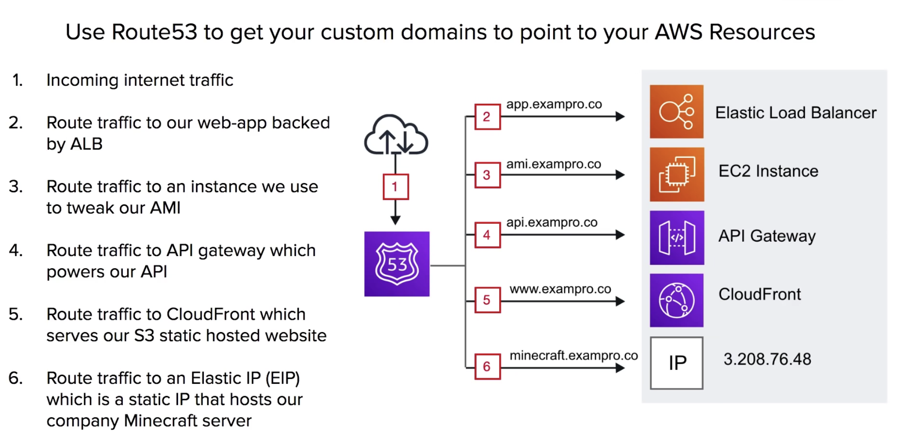
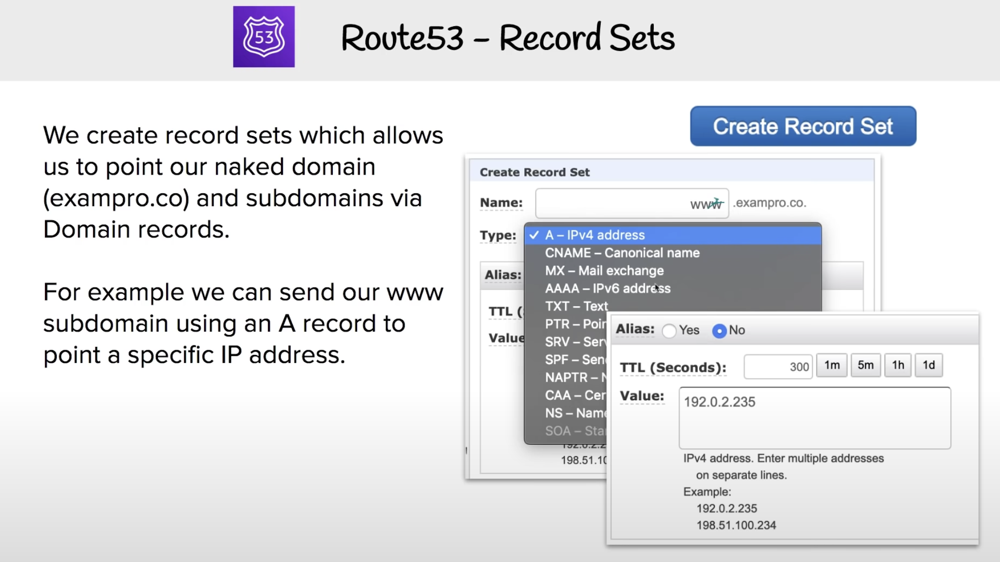
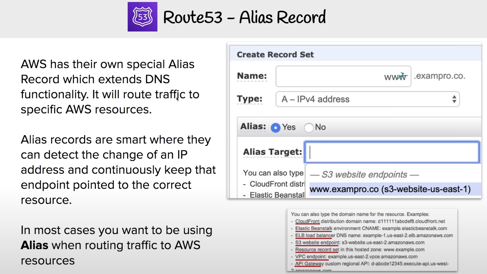

## Introductaion

Route53 is a Highly available and scalable cloud Domain Name System(DNS). Register and manage domains, create DNS routing rules. eg. failovers.

You can:
* Register and manage domains.
* Create various records sets on a domain.
* Implement complex traffic flows. eg. Blue/Green deploy, failovers.
* Continuously monitor records via health checks
* Resolve VPC's outside of AWS.

## Route53 Use Case

### Record Sets

### Record Alias

## Routing Policies

There're **7 different types** of Routing Policies available inside Route53
* **Simple Routing**
    * default routing policy, multiple addresses result in random selection
* **Weighted Routing**
    * route traffic based on wighted values to split traffic
* **Latency-Based Routing**
    * route traffic to region resource wiht lowest latency
* **Failover Routing**
    * route traffic if primary endpoint is unhealthy to secondary endpoint
* **Geolocation Routing**
    * route traffic based on the location of your users
* **Geo-proximity Routing**
    * route traffic based on the location of your resrouces and, optionally, shift traffic from resources in on location to resource in another
* **Multi-value Answer Routing**
    * respond to DNS queries with up to eight healthy records selected at random

### Simple Routing Policies

Simple Routing Policies are the most basic routing policies in Route53 **Default Policy**

* You have 1 record and provide multiple IP address
* When multiple values are specified for a record, Route53 will return all values back to the user in a **random order**

### Weighted Routing Policies

Weighted Routing Policies let you split up traffic based on different **weights** assigned.

This allows you to send a certain percentage of overall traffic to one server, and have any other traffic apart from that directed to a completely different server.

For example if you had an ALB running experimental features you could test against a small amount traffic at random to minimize the impact of affect.

### Latenct Based Routing

Latency Based Routing allows you to direct traffic based on the lowest network latency possible for your end-user **based on region**.

Requires a latency resource record to be set for the EC2 or ELB resource that hosts your application in each region.

For example, you have 2 copies of your web-app backed by ALB. One in California US, and another in Montreal Canada. An request comes in from Toronto, it will be routed to Montreal since it will have lower latency.

### Failover Routing Policies

Failover Routing Policies allow you to create active/passive setups in situations where you want a primary site in one location, and a secondary data recovery site in another.

Route53 automatically monitors health-checks from your primary site to determine the health of end-points. If an end-point is determined to be a failed state, all traffic is automatically directed to the secondary location.

For example, we have a primary and secondary web-app backed by ALB. Route53 determins our primary is unhealthy and fails over to secondary ALB.

### Geolocation Routing Policies

Geolocation Routing Policies allow you to direct traffic based on the geographic location of where the request originated from.

For example this would let you route all traffic coming from North America to servers located in North American regions, where queries from other regions could be directed to servers hosted in that region.(potentially with pricing and language specific to that region)

### Geoproximity Routing Policies

Geoproximity Routing Policies allow you to direct traffic based on the geographic location of your users, and your AWS resources.

You can route more or less traffic to a specific resource by specifying a **Bias** value.

Bias values expand or shrink the size of the geographic region from which traffic is routed to. **You must use Route53 Traffic Flow** in order to use geoproximity routing policies.

### Multi-Value Answer Policies

Multi-Value Answer Policies let you configure Route53 to return multiple values such as IP addresses for your web-services, in response to DNS queries.

Multiple values can be specified for almost any record. Route53 automatically performs health-checks on resources and only returns values of ones deemed healthy.

Similar to Simple Routing, however with an added health check for your record set resources.

## Health Check
* Checks health every **30s** by default. Can be reduce to every **10s**
* A health check can **initial a failover** if status is returned unhealthy
* A CloudWatch Alarm can be created to alert you of status unhealthy
* A health check can **monitor other health checks** to create a chain of reactions.
* Can create up to **50 health checks** for AWS endpoints that are within or linked to the same AWS account.

## Route53 Resolver

A regional service that lets you route DNS queries between your VPCs and your network.

DNS Resolution for **Hybrid Environmentsc**(On-Permise and Cloud)

## Cheat Sheet
* Route53 is a DNS provider, register and manage domains, create record sets. Think Godaddy or NameCheap
* Simple Routing
    * Default routing policy, multiple addressess result in a random endpoint selection.
* Weighted Routing
    * Split up traffic based on different **weight** assigned(percentages)
* Latency-Based Routing
    * Directs traffic based on region, for lowest possible latency for users.
* Failover Routing
    * Primary site in one location, secondary data recovery site in another.(change on health check)
* Geolocation Routing
    * Route traffic based on the geographic location of a requests origin.
* Geo-proximity Routing
    * Route traffic based on geographic location using **Bias** value(needs Route53 Traffic Flow)
* Multi-value Answer Routing
    * Return multiple values in response to DNS queries.(using health checks)
* Traffic Flow
    * Visual editor, for chaining routing policies, can version policy records for easy rollback.
* AWS Alias Record
    * AWS smart DNS record, detects changed IPs for AWS resources and adjusts automatically.
* Route53 Resolver
    * Lets you regionally route DNS queries between your VPCs and your network **Hybrid Environments**
* Health checks can be created to monitor and automatically over endpoints. You can have health check monitor other health checks.
