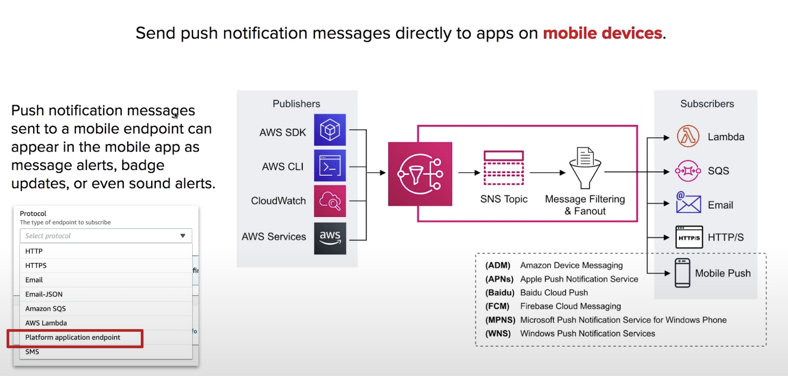

## Introduction

**Subscribe** and send notifications via text message, emails, webhooks, lambdas, SQS and mobile notifications

### What is Pub/Sub

Publish-subscribe pattern commonly implemented in **messaging system**. In a pub/sub system, the sender of messages(publishers) do not send their messages directly to receivers. They instead send their messages to an **event bus**. The event bus categorizes their messages into groups. Then receivers of messages(subscribers) subscribe to these groups. Whenever new messages appear whitin their subscription, the messages are immediately delivered to them.

* Publisher have no knowledge of who their subscribers are.
* Subscriber do **not pull** for messages.
* Messages are instead automatically and immediately **pushed** to subscribers.
* Messages and events are interchangeable terms in pub/sub.

**Simple Notification Service(SNS)** is a highly available, durable, secure, fully managed **pub/sub messaging** service that enable you to **decouple** microservices, distributed systems, and serverless applications.

* Publishers **push** events to an SNS Topic.
* Subscribers subscribe to SNS Topic to have events **pushed** to them.

## SNS Topics

**Topic** allow you to group multiple subscriptions together.

A topic is able to delivery to multiple protocols at once. eg. email, text message, http/s

When topics deliver messages to subscribers, it will automatically format your message according to the subscriber's chosen protocol.

You can encrypt Topics via **KMS**.

* Publishers don't care about the subscribers protocol.
* Subscribers listen for incoming messages.

## SNS Subscriptions

A subscription can only subscribe to one protocol and one topic.

The following protocols
* **HTTPs and HTTP** create webhooks into your web-application
* **Email** good for internal email notifications(only supports plain text)
* **Email-JSON** sneds you json via email.
* **Amazon SQS** place SNS message into SQS queue
* **AWS Lambda** triggers a lambda function.
* **SMS** sned a text message
* **Platform application endpoints** Mobile Push.

## Application as a Subscriptions

## Cheat Sheet

* **Simple Notification Service(SNS)** is a fully managed pub/sub messaging service.
* SNS is for **Application Integration**. It allow decoupled services and apps to communicate with each other.
* **Topic** is a logical access point and communication channel.
* A topic is able to deliver to multiple protocols.
* You can encrypt topics via KMS.
* **Publishers** use the AWS API via AWS CLI or SDK to push messages to a topic. Many AWS services integrate with SNS and act as publishers.
* **Subscriptions** subscribe to topics. When a topic receives a message, it automatically and immediately pushes messages to subscribers.
* All messages published to SNS are stored redundantly across multiple Availability Zones(AZ).
* The following protocols.
  * **HTTPs and HTTP** create webhooks into your web-application
  * **Email** good for internal email notifications(only supports plain text)
  * **Email-JSON** sneds you json via email.
  * **Amazon SQS** place SNS message into SQS queue
  * **AWS Lambda** triggers a lambda function.
  * **SMS** sned a text message
  * **Platform application endpoints** Mobile Push. eg. Apple, Google, Microsoft, Baidu notification systems.
