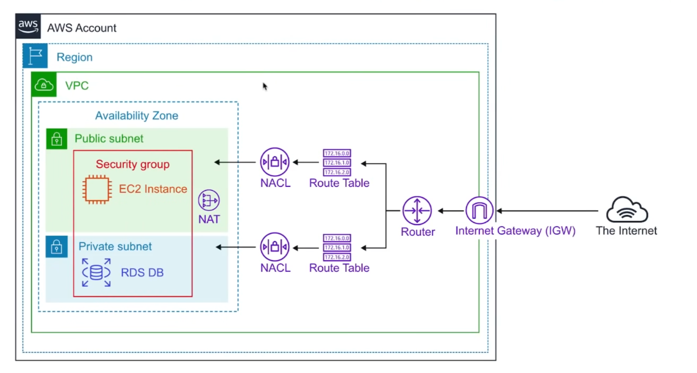
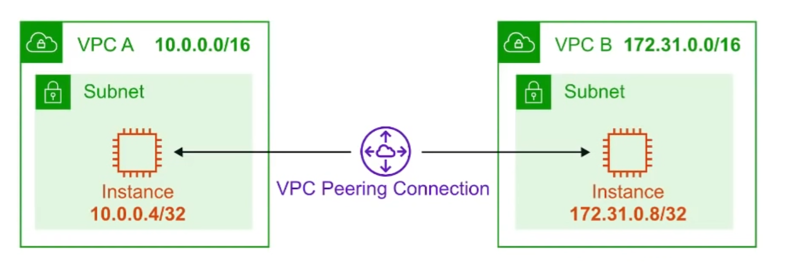
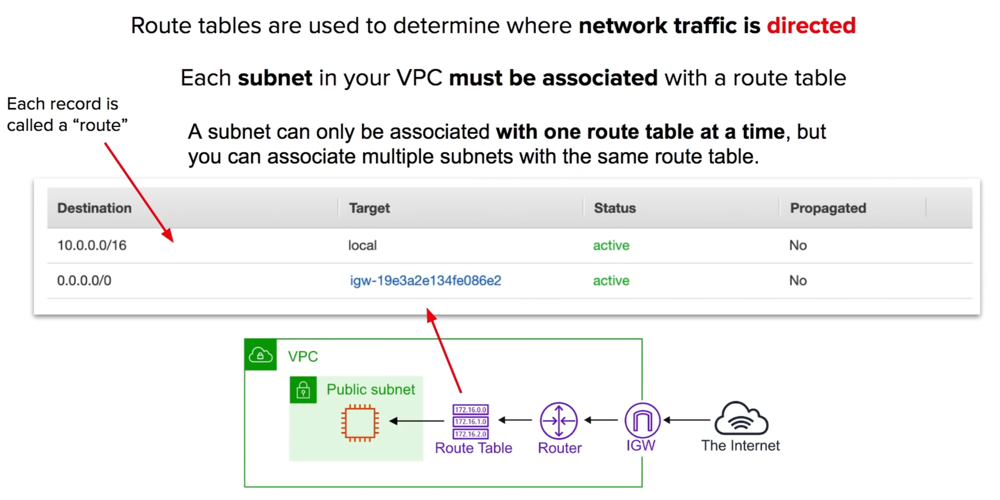
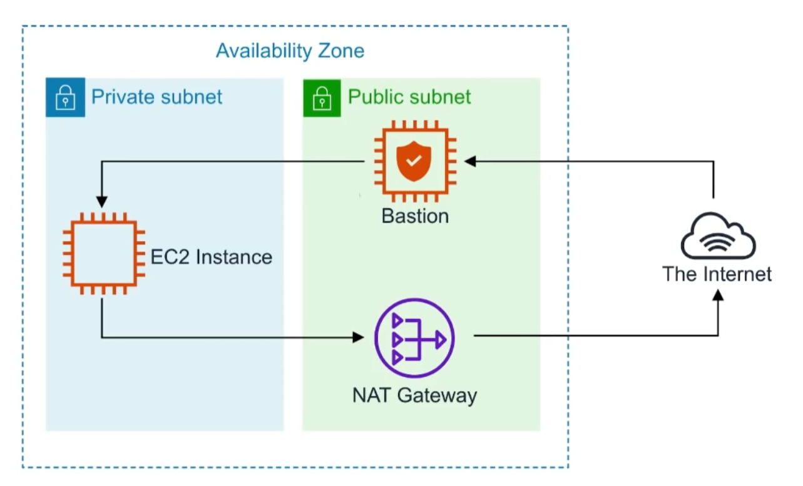
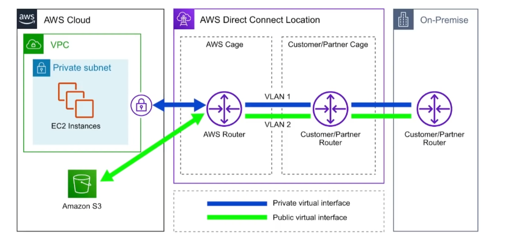
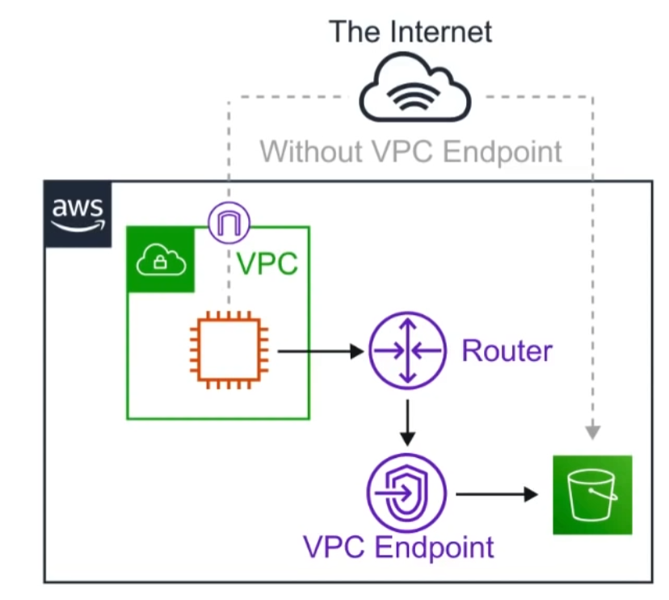

Provision a **logically isolated section of the AWS Cloud** where you can launch AWS resources in a **virtual network** that you define.

## Key Features
* VPCs are **Region Specific** they do not span regions.
* You can create upto **5 VPC** per region.
* Every region comes with a default VPC.
* You can have **200 subnets** per VPC.
* You can use **IPv4 CIDR Block** and in addition to a **IPv6 CIDR Blocker**(the address of the VPC)
* **Cost nothing**: VPC's, Route Tables, Nacls, Internet Gateways, Security Groups and Subnets, VPC Peering
* **Some things cost money**: eg. NAT Gateway, VPC Endpoints, VPN Gateway, Customer Gateway.
* **DNS hostnames** (should your instance have domain name addresses)
* When you create a VPC, the DNS hostname is disabled by default.

## Default VPC
AWS has a default VPC in every region so you can immediately deploy instances.

* Create a VPC with a size /16 IPv4 CIDR block(172.31.0.0/16)
* Create a size /20 **default subnet in each Availability Zone**
* Create an **Internet Gateway** and connect it to your default VPC.
* Create a **default security group** and associate it with your default VPC
* Create a **default network access control list(NACL)** and associate it with your default VPC.
* Associate the **default DHCP** options set for your AWS account with your default VPC.
* When you create a VPC, it automatically has a main route table.

## Default Everywhere IP

0.0.0.0/0 is also know as default, it represents all possible IP addresses.

* When we specify **0.0.0.0/0** in our route table for IGW(Internet Gateway) we are allow internet access.
* When we specific **0.0.0.0/0** in our security groups inbound rules, we are allowing all trafic from the internet access our public resources.
* When you see **0.0.0.0/0**, just think of giving access from anywhere or the internet. 

## VPC Peering

**VPC Peering** allows you to connect one VPC with another over a **direct network route** using **private IP addresses**

* Instances on peered VPCs **behave** just like they are on the **same network**
* Connect VPCs across **same** or **different AWS accounts** and **regions**
* Peering uses a **Star Configuration: 1 Central VPC-4 other VPCs**
* **No Transitive Peering**(peering must take place directly between VPCs)
  * Needs a one to one connect to immediate VPC
  * For example, A - B - C, A cannot talk to C, because there's no VPC between A and C, we must create a VPC to connect A and C, like A-C.
* **No Overlapping CIDR Blocks**

## Route Tables

## Internet Gateway(IGW)

The Internet Gateway allows **your VPC** access to the internet. IGW does two things
1. provide a target in your VPC route tables for internet-routable traffic
2. perform network address translation(NAT) for instances that have been assgined public IPv4 addressse.

To route out to the internet you need to add in your route tables you need to add a route.
To the internet gateway and set the Destination to be **0.0.0.0/0**

## Bastions/Jumpbox

Bastions are EC2 instances which are security harden. They are designed to help you gain access to your EC2 Instance via SSH or RCP That are in a private subnet.

They ars also known as Jump boxes because you are jumping from one box to access another.

NAT Gateways/Instances are only intended for EC2 instances to gain outbound access to the internet for things such as security updates. NATs cannot/should not be used as Bastions

System Manager's Sessions Manager replaces the need for Bastions.

## Direct Connect

AWS Direct Connect is the AWS solution for establishing dedicated network connections from on-premises locations to AWS

Very fase network, Lower Bandwidth **50M-500M** or Higher Bandwidth **1GB or 10GB**

Helps reduce network cost and increase bandwidth throughput.(great for high traffic networks)
Provides a more consistent network experience than a typical internet-based connection.(reliable and secure)

## VPC Endpoints 

### Introduction

Think of a secret tunnul where you don't have to leave the AWS network

**VPC Endpoints** allow you to **private connect your VPC to other AWS services** and VPC endpoint services

* **Eliminates** the need for an **Internet Gateway, NAT device, VPN connection**, or **AWS Direct Connect** connections
* **Instances** in the VPC **do not require a public address** to communicate with service resources.
* **Traffic** between your VPC and other services does not leave the AWS network
* **Horizontally scaled, redundant**, and **highly available** VPC component.
* Allows secure communication between instances and services - **without adding availability risks or bandwidth constraints** on your traffic.

### Interface Endpoints

**Interface Endpoints** are Elastic Network Interface(ENI) with a private IP address. They serve as an entry point for traffic going to a supported service.

Interface Endpoints are powerd by **AWS PrivateLink**
Access services hosted on AWS easily and securely by keeping your network traffic within the AWS network.

> Pricing per VPC endpoint per AZ ($/hour) 0.01
> Pricing per GB data processed ($) 0.01

### Gateway Endpoints

VPC Gateway Endpoints are Free

A **Gateway Endpoint** is a gateway that is a target **for a specific route** in your **route table**, used for traffic desined for a supported AWS service.

To create a Gateway Endpoint, you must specify the VPC in which you want to create the endpoint, and the service to which you want to establish the connection.

AWS Gateway Endpoint currently only supports 2 services
* Amazon S3
* DynamoDB

### VPC Endpoints Cheat Sheet

* VPC Endpoint help keep traffic between AWS services **within the AWS Network**
* There are two kinds of VPC Endpoint.
  * Interface Endpoint - cost money
  * Gateway Endpoint - free
* Interface Endpoints uses an Elastic Network Interface(ENI) with Private IP address(powerd by AWS PrivateLink)
* Gateway Endpoints is target for a specific route in your route table.
* Gateway Endpoint only support DynamoDB and S3
* Interface Endpoint suppor many AWS services

## VPC Flow Logs

### Intrduction

**VPC Flow logs** allow you to capture **IP traffic information** in-and-out of Network Interface within your VPC.

Flow Logs can be created for
1. VPC
2. Subnet
3. Network Interface

After a Flow Log is created, it can be viewed in detail within CloudWatch Logs.

### VPC Flow Logs Cheat Sheet
* **VPC Flow Logs** monitor the in-and-out traffic of your Network Interfaces within your VPC.
* You can turn on Flow Logs at the VPC, subnet or Network Interface level.
* VPC Flow Logs **cannot be tagged** like other AWS resources.
* You **cannot change the configuration** of a flow log **after it's created**
* You **cannot enable** flow logs for VPCs which are peered with your VPC **unless it is in the same account**
* VPC Flow Logs can be delivered to an **S3** or **CloudWatch Logs**
* VPC Flow Logs contains the source and destination **IP addresses**(not hostnames)
* Some instance traffic is **not monitored**
  * Instance traffic generated by contacting the AWS DNS servers
  * Windows license activation traffic from instances
  * Traffic to and from the instance metadata address(169.254.169.254)
  * DHCP Traffic
  * Any traffic to the reserved IP address of the default VPC router.

## Network Access Control List

### Introduction
