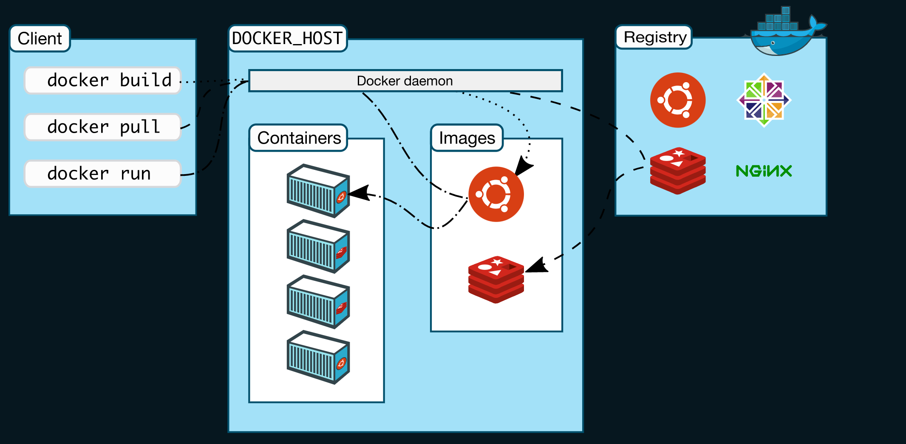

记得我在开始学习 docker 的时候，在网上查找各种教程，最后不是被复杂的命令劝退就是看着一头雾水。最后还是耐心看着[官方文档](https://docs.docker.com/get-started/)才算是入门。也许是我的理解能力比较弱，不过很多教程在读者对 docker 还一知半解的时候，上来就告诉你怎么写 dockerfile，列出一大堆命令，确实会令很多新手望而生畏。

## Docker 是什么

举个例子，一个 APP 可以运行在 IOS 平台，也可以运行在 Android 平台，这个 IOS，Andorid 就是提供应用运行的平台。类似，docker 也是一个提供应用运行的平台，你也可以把 docker 当成一个轻量级的虚拟机。

用一句话说，docker 是一个为应用提供运行时的平台。



### Docker Engine

docker 采用 client-server 的模式。docker-daemon 充当 server 的角色，docker-cli 充当 client 的角色，他们之间通过 REST API 通信。你可以认为 docker-daemon 相当于 mysqld，docker-clien 相当于 mysql-client。

### Docker 的工作方式

在谈论 docker 的工作方式之前，我们先来想一下，如果你需要在自己电脑上安装一个 win10 的虚拟机，你会怎么做？

1. 去微软官网
2. 下载 win10 镜像到本地
3. 安装

docker 的工作方式其实和你去微软官网下 win10 镜像安装差不多。只是这里的“微软官网”需要换成 docker registries。

如果你要在本地运行一个 docker 容器，那么你只需要用到 `docker-pull` 和 `docker-run` 这两个命令。

### 基本概念

上面我们已经大致了解到了 docker 的工作方式。简单来说就是拉取镜像，运行容器。从上面的图中可以看出主要有 `registries`, `image` 和 `container` 三个主要概念。

### 仓库（docker registries）

docker registries 是一个存放 docker 镜像的地方。最大的 docker 公有仓库是 [docker hub](https://hub.docker.com/)。docker hub 是一个类似 github 的平台，只不过它托管的是 docker 镜像。docker hub 上都是别人已经构建好的镜像，我们在后面说如何构建自己的镜像。

### 镜像（docker image）

镜像是一个只读的模板。你可以对比从微软官网下的 iso 镜像文件，是一个只读的文件。docker 镜像的作用只有一个，那就是构建容器。

我们可以通过命令 `docker images` 查看本地镜像。

```
$ docker images
REPOSITORY                    TAG                 IMAGE ID            CREATED             SIZE
mysql                         5.7                 718a6da099d8        6 weeks ago         448MB
gcr.io/k8s-minikube/kicbase   v0.0.11             e3ca409c7daf        6 weeks ago         953MB
```

关于 docker 镜像，另一点你需要了解的是，它是分层构建的。就像盖房子一样，新的一层总是在前一层的基础上。由于镜像是只读的，所以我们需要每一层尽可能小。如果你在某一层引入了一些不需要的东西，它们会被一起带到下一层，从而导致镜像文件很大。

还有一点需要说明的是，尽量使用现有的镜像，而不是自己从头开始构建一个。比如你需要一个 node 运行环境，就不需要先装一个 ubuntu 再安装 node。

### 容器（docker container）

容器是应用真正运行的地方。容器拥有各自独自的运行环境，互相隔离。就像你手机上的每一个 APP，微信崩溃不会影响到支付宝。

我们通过镜像来运行容器，每一个容器可以理解为一个实例。你可以通过一个镜像启动一个容器，也可以通过一个镜像启动多个容器。

在一个容器中可以运行一个应用，也可以运行多个应用。一般为了方便管理，我们都会选择在每一个容器中运行一个应用。

可以通过命令 `docker ps` 查看正在运行的容器

```
$ docker ps
CONTAINER ID        IMAGE               COMMAND                  CREATED             STATUS              PORTS                               NAMES
ef015d798237        mysql:5.7           "docker-entrypoint.s…"   11 days ago         Up 26 hours         0.0.0.0:3306->3306/tcp, 33060/tcp   mysql-5.7
```

## Docker 能做什么

docker 的用处，有兴趣的话，可以看[官网介绍](https://docs.docker.com/get-started/overview/)。这里我个人理解有这么几种场景吧。

- 方便部署
    - docker 提供了统一，独立，隔离的环境。对于运维来说，只需要把 docker 镜像放到机器上运行就可以了。从而省去了很多环境依赖的问题。
- 安装软件
    - 相信大家都遇到过，安装了一个软件，删除的时候，发现删不干净的问题。如果通过 docker 安装的话，删除的时候只要删掉容器，所有的内容都会被删除。

## 一个简单的例子，用 docker 运行 redis

下面我们通过一个简单的例子，通过 docker 启动一个 redis。和之前的不皱一样，先从 docker registries 上拉取镜像，然后本地运行。

### 查看可用镜像

我们先通过 `docker search redis` 命令，看一下 docker registries 上面都有哪些镜像。

```
$ docker search redis
NAME                             DESCRIPTION                                     STARS               OFFICIAL            AUTOMATED
redis                            Redis is an open source key-value store that…   8580                [OK]
bitnami/redis                    Bitnami Redis Docker Image                      161                                     [OK]
sameersbn/redis                                                                  81                                      [OK]
grokzen/redis-cluster            Redis cluster 3.0, 3.2, 4.0, 5.0, 6.0           71
rediscommander/redis-commander   Alpine image for redis-commander - Redis man…   47                                      [OK]
kubeguide/redis-master           redis-master with "Hello World!"                33
redislabs/redis                  Clustered in-memory database engine compatib…   26
redislabs/redisearch             Redis With the RedisSearch module pre-loaded…   24
oliver006/redis_exporter          Prometheus Exporter for Redis Metrics. Supp…   22
arm32v7/redis                    Redis is an open source key-value store that…   21
redislabs/rejson                 RedisJSON - Enhanced JSON data type processi…   18
bitnami/redis-sentinel           Bitnami Docker Image for Redis Sentinel         16                                      [OK]
redislabs/redisinsight           RedisInsight - The GUI for Redis                13
webhippie/redis                  Docker images for Redis                         12                                      [OK]
redislabs/redisgraph             A graph database module for Redis               11                                      [OK]
s7anley/redis-sentinel-docker    Redis Sentinel                                  10                                      [OK]
insready/redis-stat              Docker image for the real-time Redis monitor…   9                                       [OK]
arm64v8/redis                    Redis is an open source key-value store that…   9
redislabs/redismod               An automated build of redismod - latest Redi…   7                                       [OK]
centos/redis-32-centos7          Redis in-memory data structure store, used a…   5
circleci/redis                   CircleCI images for Redis                       5                                       [OK]
clearlinux/redis                 Redis key-value data structure server with t…   2
wodby/redis                      Redis container image with orchestration        1                                       [OK]
tiredofit/redis                  Redis Server w/ Zabbix monitoring and S6 Ove…   1                                       [OK]
xetamus/redis-resource           forked redis-resource                           0                                       [OK]
```

带有 `OFFICIAL` 说明是官方镜像，我们就用官方镜像。

### 拉取镜像

使用 `docker pull redis` 命令拉取最新镜像。

```
$ docker pull redis
Using default tag: latest
latest: Pulling from library/redis
a6d76de28f58: Downloading [>                                                  ]  262.1kB/25.85MB
3573263a91cd: Download complete
74acfbcef883: Downloading [==================================>                ]  920.8kB/1.353MB
720e1be7fe14: Downloading [=>                                                 ]  302.3kB/9.538MB
bcb81e952db9: Waiting
fa95093de04d: Waiting
```

从上面的结果，我们可以看到两点 1. 如果不指定 tag，将使用 latest，也就是最新的 tag。 1. 镜像的拉取是分层的，也刚好应证了我们说镜像是分层构建的。

### 运行容器

我们先用 `docker images` 命令来看一下本地的镜像。

```
$ docker images
REPOSITORY          TAG                 IMAGE ID            CREATED             SIZE
redis               latest              b2df71f4042b        7 days ago          98.4MB
```

可以看到，我们刚刚拉取下来的 redis 镜像已经可以看到了。

接下来我们通过 `docker run` 命令来启动 redis

```
$ docker run -p 6379:6379 -d redis:latest
479de2aabe50de2a4cfdf3e9d26690cec2ba19e23ec4256d01cf4ca83303a3e5
```

- `p 6379:6379` 表示把本地的 6379 端口映射到容器的 6379 端口上。我们需要通过网络访问 redis，就需要设置端口映射。
- `d` 表示以 detach 方式运行，也就是后台运行。
- `redis:latest` 表示镜像的名字和版本号。

这个时候我们通过 `docker ps` 命令就可以查看到已经启动的 redis

```
$ docker ps
CONTAINER ID        IMAGE               COMMAND                  CREATED             STATUS              PORTS                    NAMES
479de2aabe50        redis:latest        "docker-entrypoint.s…"   4 minutes ago       Up 4 minutes        0.0.0.0:6379->6379/tcp   hardcore_thompson
```

可以注意到: * `CONTAINER ID` 就是我们运行完 `docker run` 之后返回的那一串字符串的前几位。 * PORTS 字段表示本机 6479 端口通过 TCP 映射到容器的 6379 端口。 * 因为我们没有给容器起名，所以 NAMES 是自动生成的一个 name。

我们来测试一下 redis 是不是可以正常使用了。 因为本机没有安装过 redis，自然也无法使用 redis-cli。因为 redis 使用的是文本协议，所以我们可以通过 telnet 方式来访问 redis。

```
$ telnet 127.0.0.1 6379
Trying 127.0.0.1...
Connected to 127.0.0.1.
Escape character is '^]'.

SET key1 value1
+OK
GET key1
$6
value1
```

可以看到，redis 工作正常。

### 停止容器

假设现在你已经不需要 redis 了，可以使用命令 `docker stop` 命令停止当前正在运行的容器。

```
$ docker stop 479de2aabe50
479de2aabe50
```

后面的 id 就是用 `docker ps` 看到的 `CONTAINER ID`。当然，你也可以通过容器名来停止容器，就像这样。

```
$ docker stop hardcore_thompson
hardcore_thompson
```

这时，通过 `docker ps` 已经看不到刚才的容器了，因为 `docker ps` 查看的是正在运行的容器。

```
$ docker ps
CONTAINER ID        IMAGE               COMMAND             CREATED             STATUS              PORTS               NAMES
```

注意，这里停止容器之后，容器还没有从我们的电脑中删除，可以通过 `docker ps -a` 查看所有容器。

```
$ docker ps -a
CONTAINER ID        IMAGE               COMMAND                  CREATED             STATUS                     PORTS               NAMES
479de2aabe50        redis:latest        "docker-entrypoint.s…"   11 hours ago        Exited (0) 6 minutes ago                       hardcore_thompson
```

### 删除容器

如果容器已经不再需要，我们就可以通过 `docker rm` 命令将容器从电脑中删除。

```
$ docker rm 479de2aabe50
479de2aabe50
```

现在再用 `docker ps -a` 就看不到任何容器了。但是 redis 的镜像还在本机。这是为了方便下次启动 redis，不需要在联网拉取。

如果需要删除镜像，可以使用 `docker rmi` 命令。 ::: tip 在使用 `docker rmi` 删除镜像前，一定要确保当前镜像已经没有容器使用了，包括已经停止的容器。换句话说，你需要先删除所有相关的容器，才可以删除镜像。 :::

```
$ docker rmi b2df71f4042b
Error response from daemon: conflict: unable to delete b2df71f4042b (must be forced) - image is being used by stopped container d368fe03ec13
```

在停止所有相关容器之后，再执行 `docker rmi` 命令。

```
$ docker rmi b2df71f4042b
Untagged: redis:latest
Untagged: redis@sha256:1cfb205a988a9dae5f025c57b92e9643ec0e7ccff6e66bc639d8a5f95bba928c
Deleted: sha256:b2df71f4042bb12cbf0c22820ff3e74a101502b918a21e50475ab30c33172efc
Deleted: sha256:e01b786769f9b2c0546c1576b5260f266cc7423216df576d9ed7b6586591cb87
Deleted: sha256:a8c664e8618ed88349714b4531b0ff610adb0e32e34570c09f6065d2a14f98e2
Deleted: sha256:7493a598df96002af333e859cb0a50feab2af2ff766790103ea64e496ff50ebd
Deleted: sha256:1eaa3b2d5166d76189f5d55d8bfa6d011e6cfe50f34bbcc661b3c662b06b53a7
Deleted: sha256:b327b2b3321a8aa5d57e2acf88a48ae7e5325791dc6a7b029e174f2f61b7bdf6
Deleted: sha256:e829239188f8526355147849a4e8a5f915adb31c5a389977c79a0137787bc46a
```

再次应证了镜像是分层构造的。

## 将 docker 应用到自己的应用

到目前为止，我们用到的都是别人已经构建好的镜像，接下来我们讨论一下如何自己构建一个镜像。

假设我们现在有一个 nodejs 的应用，它只是一个很简单的 http 服务器，当我们访问时，返回 `Hello docker`。

```jsx
var http = require('http');
http.createServer(function (request, response) {
    response.writeHead(200, {'Content-Type': 'text/plain'});
    response.end('Hello Docker\n');
}).listen(8888);
```

我们在 8888 端口启动了一个简单的 http 服务器。可以简单测试一下是否可以正常工作。

```
$ curl 127.0.0.1:8888
Hello Docker
```

### 添加 Dockerfile 文件

现在你打算在另一台电脑上运行这个程序，但是不幸的是，新的电脑上并没有安装 node。现在你有两种选择。 1. 在这台电脑上安装 node。 1. 使用 docker。

下面我们通过 docker 的方式来运行程序。

假设你的目录下只有一个 `app.js` 文件，就像这样。

```
$ ls
app.js
```

创建一个空文件，命名为 `Dockerfile`，没有任何扩展名。

```
touch Dockerfile
```

然后把下面这段代码复制到 `Dockerfile` 中。

```shell
FROM node:14-alpine
WORKDIR /app
COPY . /app
RUN npm install -g nodemon
EXPOSE 8888
CMD ["nodemon", "app.js"]
```

关于这段代码是什么意思，我们等下再做说明，先复制粘贴就好。

### 构建镜像

现在，我们在当前目录下执行 `docker build -t myapp:dev .` 命令。开始构建镜像。

```shell
$ docker build -t myapp:dev .
Sending build context to Docker daemon  3.072kB
Step 1/5 : FROM node:14-alpine
14-alpine: Pulling from library/node
29e5d40040c1: Pull complete
0ec0f9965308: Pull complete
fb4a33214bdd: Pull complete
5f9b63cc7190: Pull complete
Digest: sha256:f7c6c13cd2b18c58acc1eb4ca9135468c1ab42beba34102fc25b2d512a517fbb
Status: Downloaded newer image for node:14-alpine
 ---> 4b619cec969f
Step 2/5 : WORKDIR /app
 ---> Running in c0be98cd227d
Removing intermediate container c0be98cd227d
 ---> 608ba5ecad5f
Step 3/5 : COPY . /app
 ---> c1d5add165e1
Step 4/5 : EXPOSE 8888
 ---> Running in d8789c7c5a8a
Removing intermediate container d8789c7c5a8a
 ---> ef962be3b4d6
Step 5/5 : CMD ["nodemon", "app.js"]
 ---> Running in 032e965e39c9
Removing intermediate container 032e965e39c9
 ---> 9da615f1d959
Successfully built 9da615f1d959
Successfully tagged myapp:dev
```

可以看到，这里和上面我们拉取 redis 非常相似，只是这里变成了 node 而已。

### 运行容器

我们先用 `docker images` 命令来看一下本地的镜像。

```
$ docker image
REPOSITORY          TAG                 IMAGE ID            CREATED              SIZE
myapp               dev                 9da615f1d959        About a minute ago   116MB
node                14-alpine           4b619cec969f        2 days ago           116MB
```

下面使用 `docker run` 命令运行容器。

```
$ docker run -p 3000:8888 --name myfirstapp -d myapp:dev
e600259433e7e5223e333dbc02c51e3f0ddac534de55fb053540969901bcd1b3
```

这样容器就已经启动好了，我们简单测试一下。

```
$ curl 127.0.0.1:3000
Hello Docker
```

我们用 `docker ps` 命令来看一下运行中的容器。

```
$ docker ps
CONTAINER ID        IMAGE               COMMAND                  CREATED              STATUS              PORTS                    NAMES
e600259433e7        myapp:dev           "docker-entrypoint.s…"   About a minute ago   Up About a minute   0.0.0.0:3000->8888/tcp   myfirstapp
```

现在，第一个容器化的应用就已经运行起来了。

### 命令解释

### Dockerfile

- `FROM node:14-alpine`
    - FROM 表示这个镜像是基于 `node:14-appine` 这个镜像的。每一个镜像都应该有一个基础镜像。
    - node:14-apline 表示指定 node 的版本是 14。
    - alpine 是 linux 的一个发行版，它的特点是体积很小，非常适合构建镜像。下面可以简单看一下 alpine 版本和普通版的大小对比。
    
    ```
    $ docker images
    REPOSITORY          TAG                 IMAGE ID            CREATED             SIZE
    node                14-alpine           4b619cec969f        2 days ago          116MB
    node                14                  da105ecfd1bf        2 days ago          890MB
    ```
    
- `WORKDIR /app`
    - 设置工作目录为 `/app`，这个 `/app` 是容器中的目录。
- `COPY . /app`
    - 将当前目录下的所有代码 copy 到容器的 `/app` 目录。
- `RUN npm install -g nodemon`
    - nodemon 是 nodejs 开发工具，这里不用管它。
- `EXPOSE 8888`
    - 暴露容器的 8888 端口。
- `CMD ["node", "app.js"]`
    - 在容器中执行 `node app.js` 命令。

### docker build

在定义好 Dockerfile 之后，我们就可以使用 `docker build` 来构建镜像了。你可以理解为 docker build 就是按顺序执行 Dockerfile 中的代码。

这里我们只说一下 `-t` 这个参数。`-t` 表示 tag，即为当前的镜像打一个标签。镜像的名字和 tag 用冒号`:`分割。 * node:14 表示镜像名为 node，标签是 14 * redis:latest 表示镜像名为 redis, 标签是 latest * …

在我们不指定 tag 的时候，默认会使用 latest。但是为了版本的统一，一般都会指定 tag。

最后要说的是，在 `docker build -t myapp:dev .` 最后的这个`.`，这个`.`是不能省略的，它表示当前目录。

### docker run

`docker run -p 3000:8888 --name myfirstapp -d myapp:dev` 在上面的命令中，我故意在宿主机和容器中使用了不同的端口号，为了方便区分顺序。

- `p 3000:8888`
    - 将宿主机的 3000 端口映射到容器的 8888 端口。宿主机的端口在前，容器的端口号在后。
- `-name myfirstapp`
    - 为容器指定一个名字，如果不指定的话，docker 会随机生成一个名字。

### 通过 vloume 实现动态更新

如果每次代码被修改了，都要重新构建镜像，那就太麻烦了。docker 提供了 volume 可以将宿主机的目录映射到容器中。

让我们重新运行一下容器，加上一个参数。 `-v $(pwd):/app` 表示将当前目录通过 volume 挂载到容器的 `/app` 目录。这样我们的代码就可以在宿主机和容器间共享了。

`docker run -p 3000:8888 --name myfirstapp -v $(pwd):/app -d myapp:dev`

这时候再去修改 app.js，把 `Hello Docker` 改一下，比如改成 `Hello Docker from volume`。然后再测试一下。

```
$ curl 127.0.0.1:3000
Hello Docker from volumn
```

可以看到返回的结果已经改变了。

## docker-compose

到目前为止，docker 的基本使用已经介绍的差不多了。但是如果有多个容器需要启动，一个一个运行 docker run 就显得有点繁琐了。而且，每次很长的参数也不容易记住。这时候，docker-compose 就派上用场了。

[docker-compose](https://docs.docker.com/compose/) 是一个单机下管理多个容器的解决方案。集群下一般使用 Kubernetes 或者 docker-swarm。

### 配置文件

和 Dockerfile 类似，docker-compose 也是需要定义一个配置文件，默认情况下，命名为 `docker-compose.yml`。

回到上面 nodejs 的例子，我们来定义一个 `docker-compose.yml` 文件。

```yaml
version: '3'
services:
  web:
    image: myapp:dev
    container_name: myfirstapp
    command: nodemon app.js
    restart: always
    ports:
      - '3000:8888'
    volumes:
      - "<current directory>:/app"
```

从字面上看，docker-compose 的配置文件和直接在命令行运行大同小异。只是通过配置文件的方式把命令参数记录了下来。

- services
    - 服务的列表
- web
    - 自定义的服务名。如果你的应用还需要依赖 redis，mysql 之类的，可以在与 web 平级的目录创建 redis, mysql 等配置。
- image
    - 基础镜像，我们之前已经通过 docker build 将应有构建成了镜像，所以直接从我们这个镜像启动就可以。
- container_name
    - 容器名，相当于 docker run 中的 –name。
- command
    - 容器中执行的命令，相当于 Dockerfile 中的 CMD。
- restert: always
    - 表示每次启动容器都会重新启动。
- ports
    - 指定宿主机和容器的端口映射关系。
- volumes
    - 指定宿主机和容器文件映射关系

详细的参数可以参考 [docker 官网](https://docs.docker.com/compose/compose-file/)

### 启动容器

现在我们来运行 `docker-compose up -d` 启动容器（其中 `-d` 表示以 detach 方式启动）。

```
$ docker-compose up -d
Creating network "dev_default" with the default driver
Creating myfirstapp ... done
```

接下来测试一下

```
$ curl 127.0.0.1:3000
Hello Docker
```

然后我们再修改 app.js 中的文件，把 `Hello Docker` 改成 `Hello Docker-compose`，保存然后再次测试。

```
$ curl 127.0.0.1:3000
Hello Docker-compose
```

### 关闭容器

如果想要关闭容器，使用 `docker-compose down` 即可。

```
$ docker-compose down
Stopping myfirstapp ... done
Removing myfirstapp ... done
Removing network dev_default
```

## 小结

- docker 为我们提供了一个独立，隔离的应用运行平台，我们可以通过 docker 方便的部署，安装应用。
- 通过在已有的项目中添加 `Dockerfile` 将应用构建成镜像。
- 使用 docker-compose 在单机上管理多个容器。