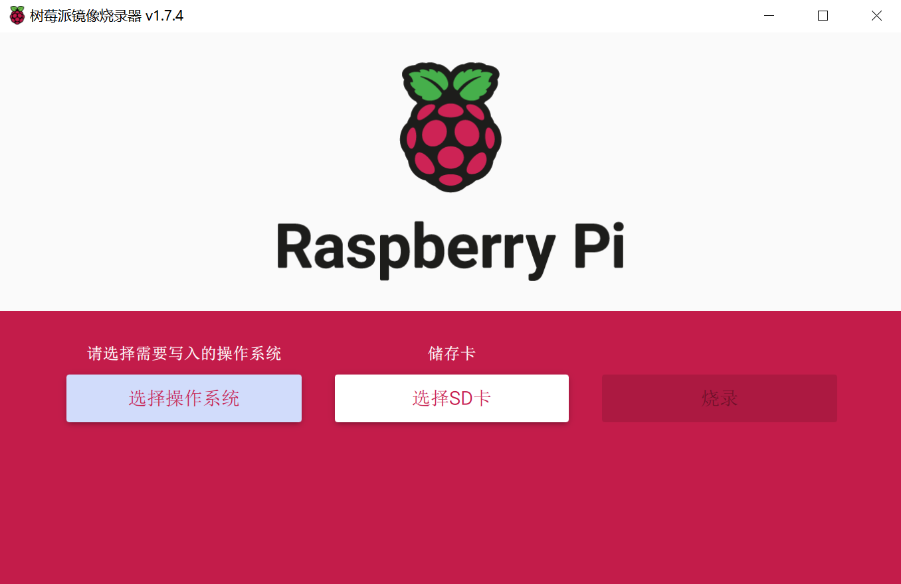

相比前一代树莓派，4B 的最大内存增加到了 8G，性能也有了不少的提升。接口方面，供电使用了 USB type-c 供电，视频输出从 HDMI 变为了两个 micro HDMI 接口，所以如果需要外接显示器，还是需要一个 micro HDMI 的转接线的。

## 准备工作
* SD 卡，用于烧录系统
* micro HDMI 转接线 (第一次安装最好还是接上显示器，可以方便调试问题)
* 电源

## 烧录系统

### 下载[官方](https://www.raspberrypi.org/downloads/)烧录工具

选择合适的操作系统

### 安装烧录工具
#### 选择操作系统和 SD 卡
插入 SD 卡，选择需要的操作系统和目标 SD 卡，并开始烧录。


* 因为官方的系统目前没有 64 位的，我这里使用的 ubuntu20 系统

## 配置 ssh 和 wifi
由于 ubuntu 官方镜像已经为我们配置了 ssh，所以我们只需要配置 wifi 即可。
> 也可以参考[官方教程](https://ubuntu.com/tutorials/how-to-install-ubuntu-on-your-raspberry-pi#1-overview)

::: tip
在配置 wifi 之前，请确保你的 wifi 没有设置隐藏，否则树莓派可能无法自动连接
:::

### 设置 WiFi
目前有两种方式设置 WiFi，推荐使用第一种，比较简单。
1. 在烧录时配置（推荐）
   1. 在烧录开始之前，点击右下角的设置按钮。
   2. 在弹出的界面上设置 SSH 和 WiFi
2. 烧录完成后修改配置文件。
   1. 在烧录完系统之后，SD 卡默认会弹出，重新插回电脑，进行 wifi 的配置。
   2. 打开 `network-config` 文件，文件应该类似这个样子。
    ```yaml
    # Some additional examples are commented out below

    version: 2
    ethernets:
    eth0:
        dhcp4: true
        optional: true
    #wifis:
    #  wlan0:
    #    dhcp4: true
    #    optional: true
    #    access-points:
    #      myhomewifi:
    #        password: "S3kr1t"
    #      myworkwifi:
    #        password: "correct battery horse staple"
    #      workssid:
    #        auth:
    #          key-management: eap
    #          method: peap
    #          identity: "me@example.com"
    #          password: "passw0rd"
    #          ca-certificate: /etc/my_ca.pem
    ```
   3. 去掉 wifis 部分的注释，在 access-points 下加上自己的 wifi 名称和密码。修改完的文件应该类似这样。
    ```yaml
    # Some additional examples are commented out below

    version: 2
    ethernets:
    eth0:
        dhcp4: true
        optional: true
    wifis:
    wlan0:
        dhcp4: true
        optional: true
        access-points:
          wifiName:
            password: "your wifi password"
    #     myworkwifi:
    #       password: "correct battery horse staple"
    #     workssid:
    #       auth:
    #         key-management: eap
    #         method: peap
    #         identity: "me@example.com"
    #         password: "passw0rd"
    #         ca-certificate: /etc/my_ca.pem
    ```
    

#### 将 SD 卡插入树莓派，接通电源
* 等待 2 分钟左右，让系统启动。
* 打开路由器，查找是否有名为 Ubuntu 的设备连接上路由器。
* 一般情况，这个时候是看不到设备的。如果你连接了显示器，直接重启设备即可。
* 如果没有连接显示器，关掉电源，重新打开，等待 1-2 分钟系统启动，就可以在路由器中看到设备了。

### 修改默认 ssh 密码
ubuntu 默认用户名和密码都是 ubuntu，第一次 ssh 连接，会提示修改密码。修改成功后，连接会断开，再使用新密码登陆即可。


## 系统配置

### 创建账户
```shell
sudo adduser username
```
赋予用户 sudo 权限
```shell
sudo vim /etc/sudoers
```

### 禁用 root 和默认 ubuntu 用户
使用新用户登陆
```shell
sudo passwd -l root
sudo passwd -l ubuntu
```

### 替换 apt 国内镜像
这里使用[清华大学的镜像](https://mirrors.tuna.tsinghua.edu.cn/help/ubuntu/)
因为树莓派的 CPU 的架构是 arm 的，所以需要稍微改一下路径(改为 ubuntu-ports 的镜像)
> 配置文件在 `/etc/apt/sources.list`

```shell
# 默认注释了源码镜像以提高 apt update 速度，如有需要可自行取消注释
deb https://mirrors.tuna.tsinghua.edu.cn/ubuntu-ports/ focal main restricted universe multiverse
# deb-src https://mirrors.tuna.tsinghua.edu.cn/ubuntu/ focal main restricted universe multiverse
deb https://mirrors.tuna.tsinghua.edu.cn/ubuntu-ports/ focal-updates main restricted universe multiverse
# deb-src https://mirrors.tuna.tsinghua.edu.cn/ubuntu/ focal-updates main restricted universe multiverse
deb https://mirrors.tuna.tsinghua.edu.cn/ubuntu-ports/ focal-backports main restricted universe multiverse
# deb-src https://mirrors.tuna.tsinghua.edu.cn/ubuntu/ focal-backports main restricted universe multiverse
deb https://mirrors.tuna.tsinghua.edu.cn/ubuntu-ports/ focal-security main restricted universe multiverse
# deb-src https://mirrors.tuna.tsinghua.edu.cn/ubuntu/ focal-security main restricted universe multiverse

# 预发布软件源，不建议启用
# deb https://mirrors.tuna.tsinghua.edu.cn/ubuntu/ focal-proposed main restricted universe multiverse
# deb-src https://mirrors.tuna.tsinghua.edu.cn/ubuntu/ focal-proposed main restricted universe multiverse
```

运行 `sudo apt-get update` 更新镜像。

## 常用软件安装
### 安装 zsh 和 oh-my-zsh
```shell
sudo apt-get install zsh
sh -c "$(curl -fsSL https://raw.github.com/ohmyzsh/ohmyzsh/master/tools/install.sh)"
```
:::tip
由于国内网络情况，直接访问 `raw.github.com` 是无法访问的，配置一下 hosts。
下面的仅供参考
```
151.101.108.133 raw.github.com
199.232.68.133 raw.githubusercontent.com
```
:::

更改默认 shell 为 zsh
`chsh -s /bin/zsh`

### 安装 [the_silver_searcher](https://github.com/ggreer/the_silver_searcher)
```shell
sudo apt-get install silversearcher-ag
```

### 安装 docker
这里通过官方脚本进行安装
```shell
curl -fsSL https://get.docker.com -o get-docker.sh
sudo sh get-docker.sh

# 添加用户到 docker group
sudo usermod -aG docker your-user
```

这个时候直接运行 `docker run hello-world` 会提示 permission denid, 需要退出一下，重新登陆就可以正常运行了。

### 安装 docker-compose
由于 docker 官方没有提供 arm 架构的 docker-compose，所以需要使用 pip 的方式来安装。

ubuntu 默认应该已经安装了 python3，可以通过直接运行 python3 来查看当前的 python 版本。
```shell
$ python3
Python 3.8.2 (default, Jul 16 2020, 14:00:26)
[GCC 9.3.0] on linux
Type "help", "copyright", "credits" or "license" for more information.
```

#### 安装 pip3
:::tip
由于 python 版本的问题，如果使用的是 python3，一定要使用 pip3 而不是 pip
:::

```shell
sudo apt-get install python3-pip
```

#### 安装 docker-compose
在安装 docker-compose 之前，需要先安装一下 `libffi-dev` 

```shell
sudo apt-get install libffi-dev
pip3 install docker-compose
```

docker-compose 安装完成之后，默认是不在 PAHT 中的，需要添加到 PATH 中。
```shell
WARNING: The script docker-compose is installed in '/home/your user name/.local/bin' which is not on PATH.
```

## 常见问题
### Could not get lock
```
E: Could not get lock /var/lib/dpkg/lock-frontend. It is held by process 2191 (unattended-upgr)
N: Be aware that removing the lock file is not a solution and may break your system.
E: Unable to acquire the dpkg frontend lock (/var/lib/dpkg/lock-frontend), is another process using it?
```

删除 lock 文件
```shell
sudo rm /var/lib/dpkg/lock
sudo rm /var/cache/apt/archives/lock
```